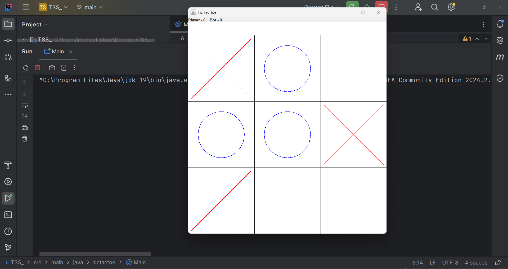
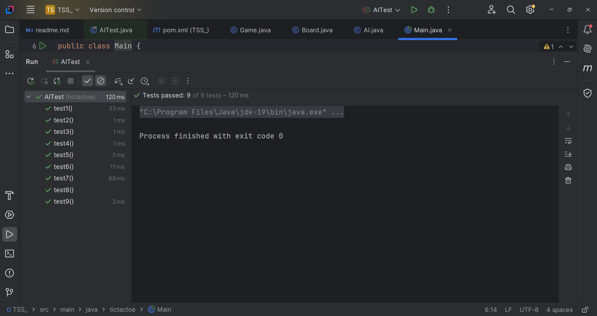
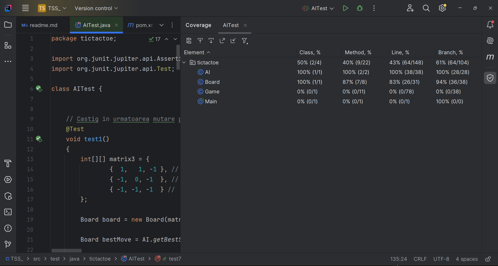
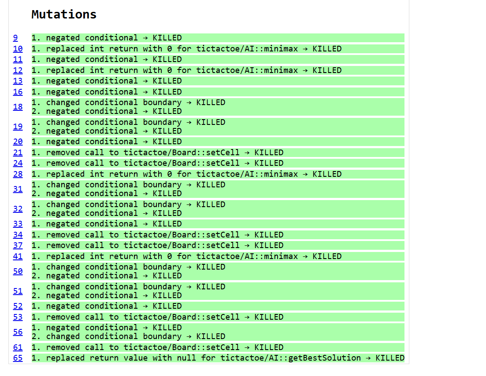
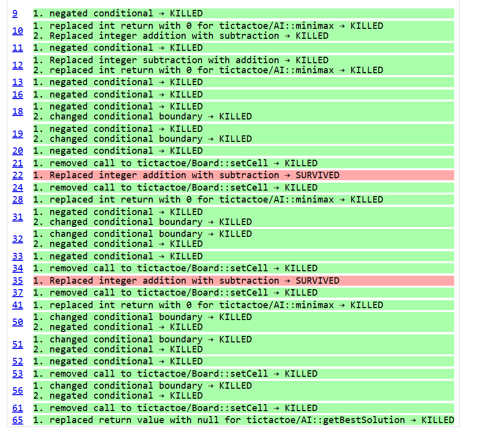

# T3: Testare unitară în Java



## Descriere generala a aplicatiei.

O joc de tip Tic Tac Toe scris in limbajul Java,
cu interfata grafica scrisa cu ajutorul librariei
Swing.
Jucatorul joaca impotriva calculatorului care foloseste un algoritm de tip minmax,
pentru a calcula mutarea propriei.
O descriere scurta a functiei minmax, e practic o parcurgere in adancime(DFS), in care 
pentru a calcula cu certitudine, daca board-ul curent este castigator sau nu,
trebuie sa se joace alternativ "optim".

Pentru acest proiect voi testa clasa AI, functional, structural si folosind mutation testing.

## Tehnologii Folosite Pentru Testare

- JUnit 5 (functional testing)
- Code coverage for Java plugin (structural testing)
- PITest (mutation testing)

## Functional Testing

Fiecare test reprezinta o clasa de echivalenta, partitionand input-ul in 9, clase,
alegand cate un reprezentant valideaza intreaga clasa.

### Test 1

Specificatie: 

Input:
```
X | X | _
_ | O | _
_ | _ | _
```
Output:
```
X | X | O
_ | O | _
_ | _ | _

```

Testul are ca scop, sa testeze functia getBestSolution, daca poate
sa vada imediat, faptul ca va pierde daca nu blocheaza jucatorul in momentul curent.


### Test 2

Input:

```
X | _ | _
_ | X | _
O | _ | _
```

Output:

```
X | _ | _
_ | X | _
O | _ | O
```

In mod similar cu testul 1, doar ca de data asta se testeaza pe diagonala in loc de rand.

### Test 3

Input:

```
X | _ | _
X | O | _
_ | _ | _
```

Output:

```
X | _ | _
X | O | _
O | _ | _
```

In mod similar cu testul 2 si 3, doar ca de data asta se testeaza pe coloana in loc de rand sau diagonala.

### Test 4

Input:

```
X | X | _
O | O | _
X | _ | _
```

Output:
```
X | X | _
O | O | O
X | _ | _
```

Daca la mutarea curenta, O poate castiga, atunci alege mutarea castigatoare directa, si nu
sa blocheze X.

### Test 5

Input:

```
_ | _ | X
_ | O | _
X | _ | _
```

Output:
```
_ | O | X
_ | O | _
X | _ | _
```

Sau oricare O care se afla pe muchie, si nu pe colturi.

### Boundary values analysis

### Test 6

Input:

```
_ | _ | X
_ | _ | _
_ | _ | _
```

Output:
```
_ | _ | X
_ | O | _
_ | _ | _
```

### Test 7

Input:

```
_ | _ | _
_ | _ | _
_ | _ | _
```

Output:
```
_ | _ | _
_ | O | _
_ | _ | _
```

### Test 8

Input:

```
X | O | X
O | O | X
O | X | _
```

Output:
```
X | O | X
O | O | X
O | X | O
```

### Test 8

Input:

```
X | O | X
O | O | X
O | X | O
```

Output:
```
null
```

Screenshot:



## Structural Testing



## Mutation Testing



Aceasta este varianta finala.

Folosind mutation testing, am reusit sa deduc impreuna
cu 2 muntatii, 2 instructiuni redundante in codul meu.



Initial functia minimax avea 3 parametri (board,depth, isMinPlayer)

Mutantii au observat faptul ca modificant depth, de la adunare la scadere,
ca acest aspect nu schimba rezultatul final.
Dar in acelasi timp testele erau corecte, ceea ce inseamna ca,
intr-adevar mutantii aveau dreptate, si parametrul respectiv era redundant.
Prin modificarea aceea, ucidem si "ultimii 2 mutanti in viata".

Comenzi rulate pentru mutation testing:

```
mvnd org.pitest:pitest-maven:mutationCoverage
```
(maven rulat din linia de comanda)